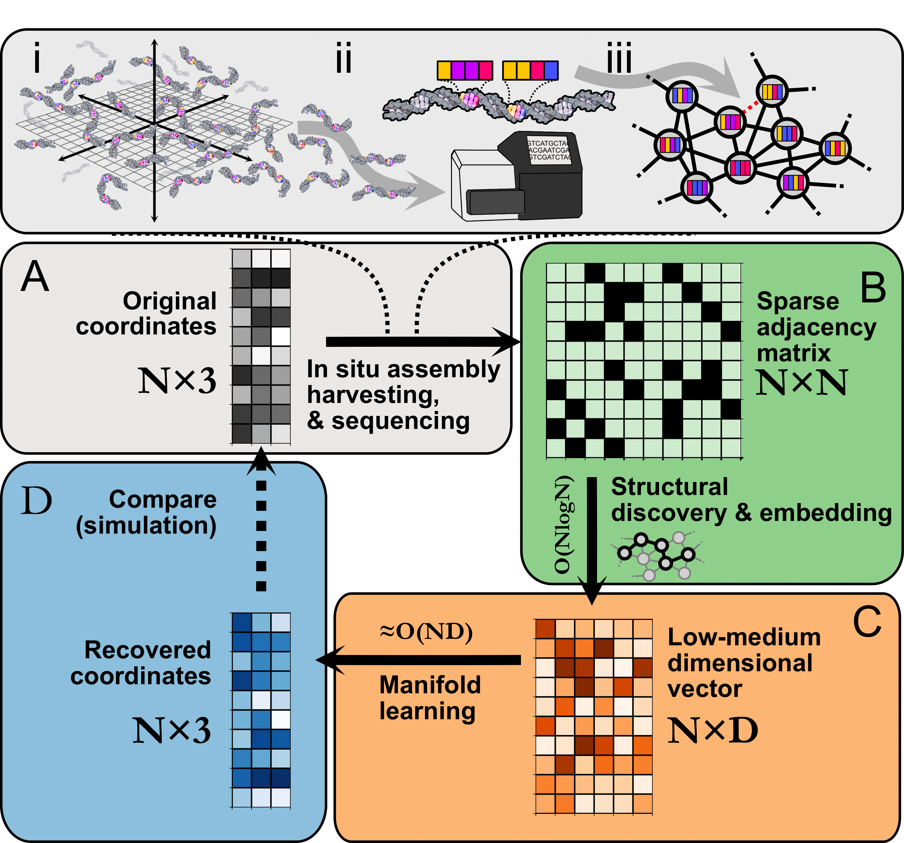

# Image Recovery

This is a companion repository to our [paper](https://www.biorxiv.org/content/10.1101/2022.09.29.510142v1) (Fernandez Bonet & Hoffecker 2023, Image recovery from unknown network mechanisms for DNA sequencing-based microscopy.
See [`demo.ipynb`](https://github.com/pathto/demo.ipynb) for a step-by-step guide.

The other notebooks generate figures that we have in the paper:

* [`toy-example.ipynb`](https://github.com/toy-example.ipynb)

